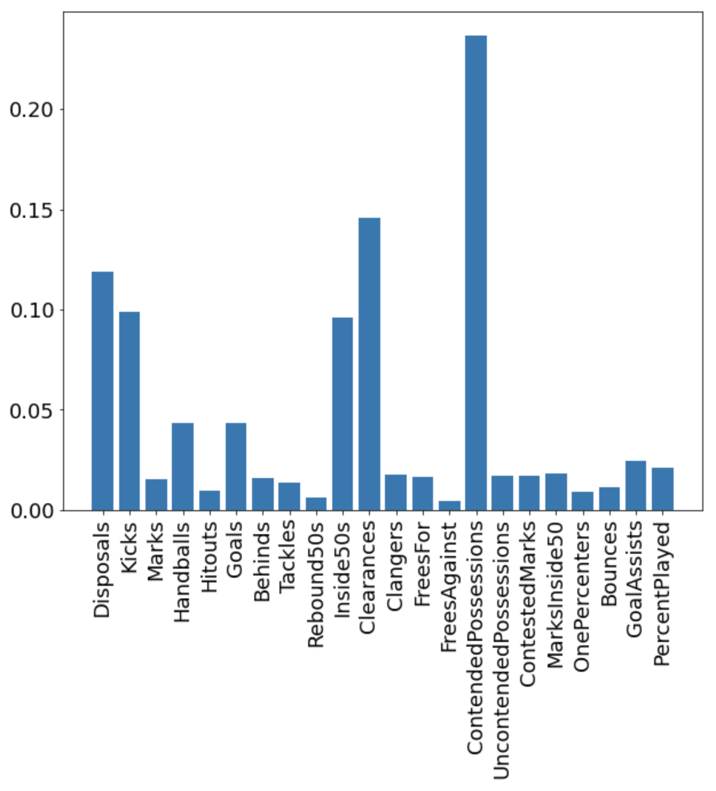

# AFL Brownlow Medal Predictor


_Disclaimer:_ I do not endorse betting of any kind. This project is not intended to assist me make lots of money, but more a fun way to see if I could beat the system. Enjoy!

Australian Rules Football is a fantastic game to watch and a brilliant sport to predict. Each year, one player is awarded the Brownlow Medal (the MVP of the season). After each game, the on-field referees decide which player should receive one-vote, two-votes and three-votes. At the end of the season, all of those votes are tallied and the player with the most wins the medal. 
This of course draws a lot of betting and speculation to determine who will win the medal. And thus, the problem: 

**Can an algorithm help predict the winner of the Brownlow Medal?**

To help me do so I attained data from the 2003-2019 AFL seasons and trained a model to predict the amount of votes each player will receive in each of those seasons. The player that was predicted to have the highest amount of votes should theoretically be the winner of the medal. 

[The code can be found here](https://github.com/simonlipson/simon_lipson_projects.github.io/blob/master/AFL%20Brownlow%20Predictor.ipynb)

The project followed the following steps:
1. Collect the data
- [kaggle.com](https://www.kaggle.com/stoney71/aflstats)
- [afltables.com](www.afltables.com)
2. Clean and normalize the data
3. Feature engineering through aggregation
4. Train, test splitting of the data by years
5. Evaluating regression models
6. Tuning hyperparameters of the model
7. Fitting the model with training data
8. Generating predictions with test data
9. Visualizing the outcomes in appropriate way

Follow all the above steps in the [notebook](https://github.com/simonlipson/simon_lipson_projects.github.io/blob/master/AFL%20Brownlow%20Predictor.ipynb). 
See below for the highlights.

### Evaluating Different Regression Algorithms

I used a k-fold cross validation to evaluate the accuracy of several different regression models. This validation optimized for r-squared which is a standard metric for regression algorithm evaluation. See the results below:


The above shows that the Gradient Boosting Regression model (GBM) clearly outperforms the other models. It received an r2 score of ~0.72, where a score of 1.0 is the highest possible score.

_snippet of source code_
```python
models = []
models.append(('LR',LinearRegression()))
models.append(('LASSO', Lasso()))
models.append(('EN', ElasticNet()))
models.append(('KNN', KNeighborsRegressor()))
models.append(('CART', DecisionTreeRegressor()))
models.append(('GBM', GradientBoostingRegressor()))


results = []
names = []
for name, model in models:
    kfold = StratifiedKFold(n_splits=10, random_state=1, shuffle=True)
    cv_results = cross_val_score(model, X_train[0], y_train[0], cv=kfold, scoring='r2')
    results.append(cv_results)
    names.append(name)

pyplot.boxplot(results, labels=names)
pyplot.title('Algorithm Comparison')
pyplot.show()
```

### Tuning algorithm for hyperparameters

The GBM has many different parameters that can be changed to further optimize the model's performance. To avoid teadiously trying many different combinations of different parameters, I used grid search cross validation to get the best combination for learning_rate, max_depth, min_depth and max_features. This analysis was conducted with n_estimators = 3000. See the results below:

```python
{'learning_rate': 0.01,
 'max_depth': 4,
 'max_features': 0.3,
 'min_samples_leaf': 17}
 ```
 
 _snippet of source code_
 ```python
 param_grid = {'learning_rate': [0.1, 0.05, 0.02, 0.01],
'max_depth': [4, 6],
'min_samples_leaf': [3, 5, 9, 17],
'max_features': [1.0, 0.3, 0.1] ## not possible in our example (only 1 fx)
}

est = GradientBoostingRegressor(n_estimators=3000)

gs_cv = GridSearchCV(est, param_grid, n_jobs=4).fit(X_train[0], y_train[0])

gs_cv.best_params_
```

### Generating Predictions

With the model selected, tuned and fitted, I generated predictions. The model was predicting the amount of votes each player would receive at the end of the season. The player with the highest amount of votes is the player that theoretically should have won the medal in that season.

I did this for every season from 2003-2019, training the model with data from all other seasons than the one being predicted on:
- e.g. Predict 2019 winner, train on 2003-2018 data

See the table below for the top 3 predicted highest scorers for each season. The actual winner for that season is **bolded**

|    | 2003                | 2004              | 2005             | 2006               | 2007                 | 2008              | 2009              | 2010                | 2011              | 2012                     | 2013                  | 2014                     | 2015                     | 2016                     | 2017                     | 2018                     | 2019               |
|---:|:--------------------|:------------------|:-----------------|:-------------------|:---------------------|:------------------|:------------------|:--------------------|:------------------|:-------------------------|:----------------------|:-------------------------|:-------------------------|:-------------------------|:-------------------------|:-------------------------|:-------------------|
|  1st | **2003Buckley, Nathan** | 2004Brown, Nathan | 2005Judd, Chris  | 2006Judd, Chris    | 2007Ablett, Gary     | 2008Mitchell, Sam | **2009Ablett, Gary**  | 2010Ablett, Gary    | **2011Swan, Dane**    | 2012Cotchin, Trent       | **2013Ablett, Gary**      | 2014Dangerfield, Patrick | 2015Gray, Robbie         | **2016Dangerfield, Patrick** | **2017Martin, Dustin**       | 2018Dangerfield, Patrick | 2019Kelly, Tim     |
|  2nd | 2003Black, Simon    | **2004Judd, Chris**   | **2005Cousins, Ben** | 2006Goodwin, Simon | 2007Corey, Joel      | **2008Cooney, Adam**  | 2009Boyd, Matthew | 2010Montagna, Leigh | 2011Murphy, Marc  | 2012Dangerfield, Patrick | 2013Swan, Dane        | 2014Selwood, Joel        | **2015Fyfe, Nat**            | 2016Kennedy, Josh P      | 2017Dangerfield, Patrick | 2018Cripps, Patrick      | 2019Prestia, Dion  |
|  3rd | 2003Cousins, Ben    | 2004Black, Simon  | 2005Hodge, Luke  | 2006Hall, Barry    | 2007Pavlich, Matthew | 2008Ablett, Gary  | 2009Swan, Dane    | 2010Swan, Dane      | 2011Mitchell, Sam | 2012Ablett, Gary         | 2013Pendlebury, Scott | 2014Gray, Robbie         | 2015Dangerfield, Patrick | 2016Treloar, Adam        | 2017Mitchell, Tom        | **2018Mitchell, Tom**        | 2019Martin, Dustin |

The model was able to predict the actual winner in the top 3 11 out of 17 times, of which 6 times it got the actual medalist correct. Whilst those numbers might not be significant enough to place secure betts on, it does show some promise.

_snippet of source code_
```python
model = GradientBoostingRegressor(n_estimators=3000, learning_rate= 0.01, max_depth= 4, max_features= 0.3, min_samples_leaf= 17)
results = []
for i in range(len(X_test)):
    model.fit(X_train[i], y_train[i])
    y_pred = model.predict(X_test[i])
    results.append(pd.DataFrame({'actual': y_test[i],
                                'prediction': y_pred})
                  .sort_values('prediction', ascending=False).reset_index())
                  
joined_results = pd.concat(results, axis = 1)
top3 = joined_results['season_player'].head(3)
top3.columns = years
```

### Feature Importance

Lastly it was interesting to me to find which on-field statistics seem to have the greatest impact on the predicted score. As it is the referees and not the fans who decide, there is a subjectivity that arrises from their specific view-point. This may mean that certain stats that the footy (football) fan may deem to be a good indication of Brownlow vote contention, may actually not be. See the below table to see the importance of each feature:



_snippet of source code_
```python
importance = model.feature_importances_
bars = X_test[0].columns
y_pos = range(len(bars))
pyplot.bar(X_test[0].columns, importance)
pyplot.xticks(y_pos, bars, rotation=90)
pyplot.show()
```

### Conclusion

Unfortunately, the model didn't perform well enough to secure a high chance of a cashout with the bookies. However, it did show that in 11 out of the 17 years, the actual winner was within the top 3 of my predictions. As such, the model can be used to complement other available information out there (like the odds) to give a better chance of winning some money. The following betting guide can minimise the possibility of loss (_however I recommend against ACTUALLY using this guide to place real bets_):

1. The betting favorite has **less than $2** odds and is in your predictions --> only bet on the favorite
2. The betting favorite has **more than $2** odds and is in your predictions --> bet same amount on the favorite and next highest prediction
3. The betting favorite has **more than $3** odds and is in your predictions --> bet same amount on all three of your predictions
4. The betting favorite is not in your predictions --> have fun and don't expect anything

If the above is applied with the historical betting odds I could find in various old new articles: 

- I win money in 8 years 
- I lose money in 3 years
- I break even in 6 years

All in all over 17 years I would have made a profit

