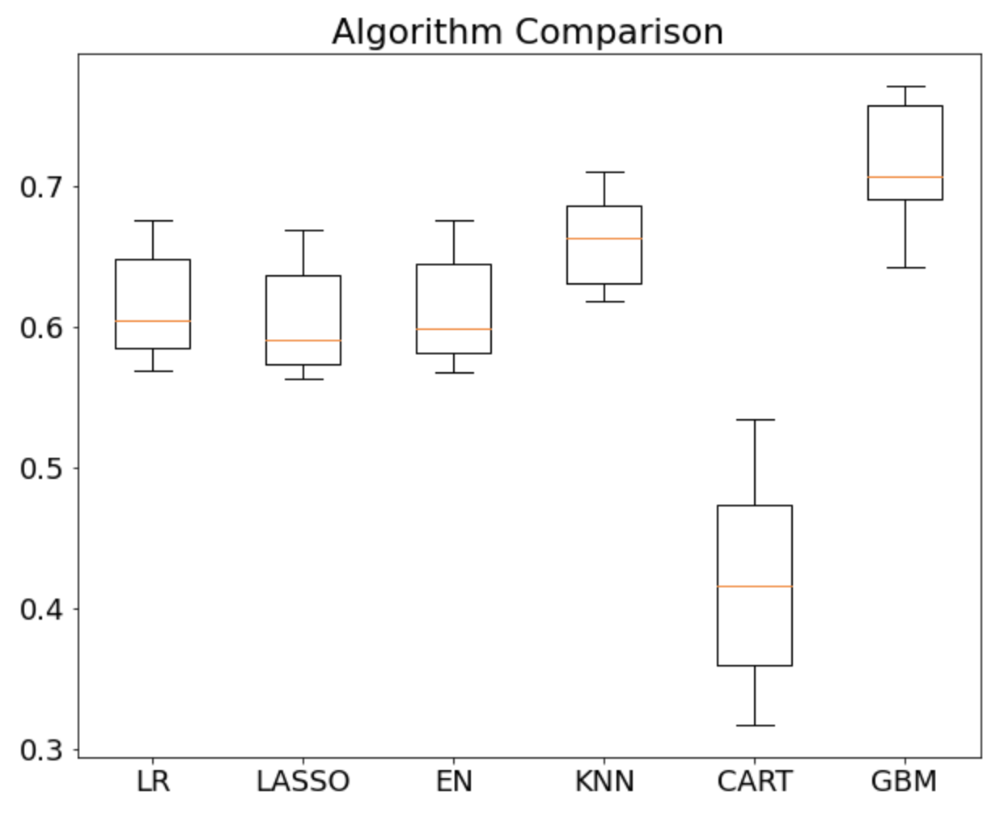

# Simon Lipson Projects
Here you will find projects of mine mainly focused on machine learning.
## AFL Brownlow Medal Predictor


Australian Rules Football is a fantastic game to watch and a brilliant sport to predict. Each year, one player is awarded the Brownlow Medal (the MVP of the season). After each game, the on-field referees decide which player should receive one-vote, two-votes and three-votes. At the end of the season, all of those votes are tallied and the player with the most wins the medal. 
This of course draws a lot of betting and speculation to determine who will win the medal. And thus, the problem: 

**Can an algorithm help predict the winner of the Brownlow Medal?**

To help me do so I attained data from the 2003-2019 AFL seasons and trained a model to predict the amount of votes each player will receive in each of those seasons. The player that was predicted to have the highest amount of votes should theoretically be the winner of the medal. 

[The code can be found here](https://github.com/simonlipson/simon_lipson_projects.github.io/blob/master/AFL%20Brownlow%20Predictor.ipynb)

The project followed the following steps:
1. Collect the data
- [kaggle.com](https://www.kaggle.com/stoney71/aflstats)
- [afltables.com](www.afltables.com)
2. Clean and normalize the data
3. Feature engineering through aggregation
4. Train, test splitting of the data by years
5. Evaluating regression models
6. Tuning hyperparameters of the model
7. Fitting the model with training data
8. Generating predictions with test data
9. Visualizing the outcomes in appropriate way

Follow all the above steps in the [notebook](https://github.com/simonlipson/simon_lipson_projects.github.io/blob/master/AFL%20Brownlow%20Predictor.ipynb). 
See below for the highlights.

### Evaluating Different Regression Algorithms

I used a k-fold cross validation to evaluate the accuracy of several different regression models. This validation optimized for r-squared which is a standard metric for regression algorithm evaluation. See the results below:



The above shows that the Gradient Boosting Regression model (GBM) clearly outperforms the other models. It received an r2 score of ~0.72, where a score of 1.0 is the highest possible score.

```python
models = []
models.append(('LR',LinearRegression()))
models.append(('LASSO', Lasso()))
models.append(('EN', ElasticNet()))
models.append(('KNN', KNeighborsRegressor()))
models.append(('CART', DecisionTreeRegressor()))
models.append(('GBM', GradientBoostingRegressor()))


results = []
names = []
for name, model in models:
    kfold = StratifiedKFold(n_splits=10, random_state=1, shuffle=True)
    cv_results = cross_val_score(model, X_train[0], y_train[0], cv=kfold, scoring='r2')
    results.append(cv_results)
    names.append(name)

pyplot.boxplot(results, labels=names)
pyplot.title('Algorithm Comparison')
pyplot.show()
```

### Tuning algorithm for hyperparameters

The GBM has many different parameters that can be changed to further optimize the model's performance. To avoid teadiously trying many different combinations of different parameters, I used grid search cross validation to get the best combination for learning_rate, max_depth, min_depth and max_features. This analysis was conducted with n_estimators = 3000. See the results below:

```python
{'learning_rate': 0.01,
 'max_depth': 4,
 'max_features': 0.3,
 'min_samples_leaf': 17}
 ```
 
 ```python
 param_grid = {'learning_rate': [0.1, 0.05, 0.02, 0.01],
'max_depth': [4, 6],
'min_samples_leaf': [3, 5, 9, 17],
'max_features': [1.0, 0.3, 0.1] ## not possible in our example (only 1 fx)
}

est = GradientBoostingRegressor(n_estimators=3000)

gs_cv = GridSearchCV(est, param_grid, n_jobs=4).fit(X_train[0], y_train[0])

gs_cv.best_params_
```

### Generating Predictions

With the model selected, tuned and fitted, I generated predictions. The model was predicting the amount of votes each player would receive at the end of the season. The player with the highest amount of votes is the player that theoretically should have won the medal in that season.

I did this for every season from 2003-2019, training the model with data from all other seasons than the one being predicted on:
- e.g. Predict 2019 winner, train on 2003-2018 data


