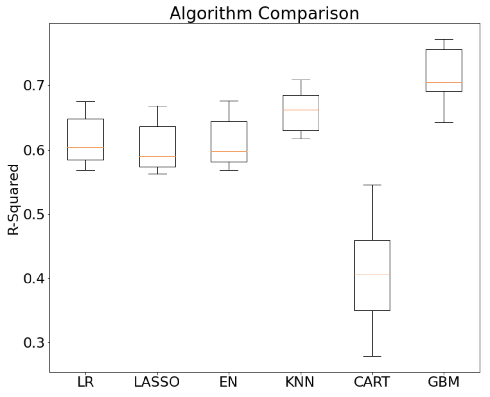
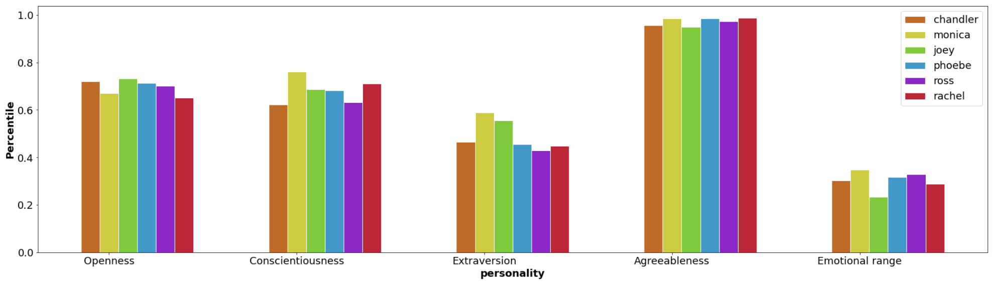
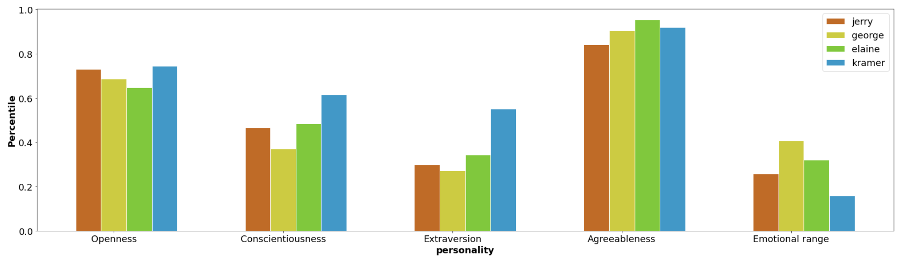
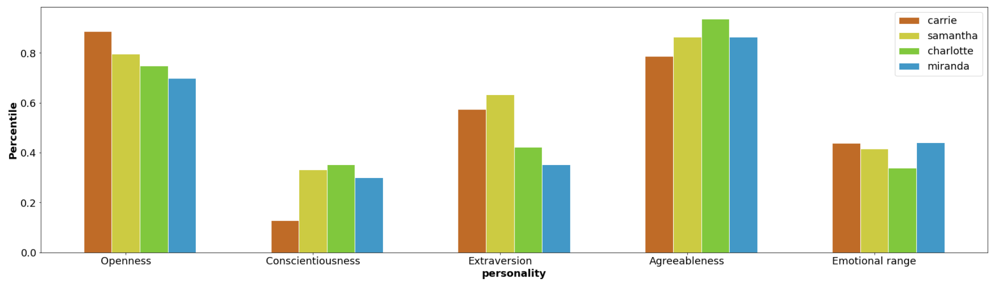
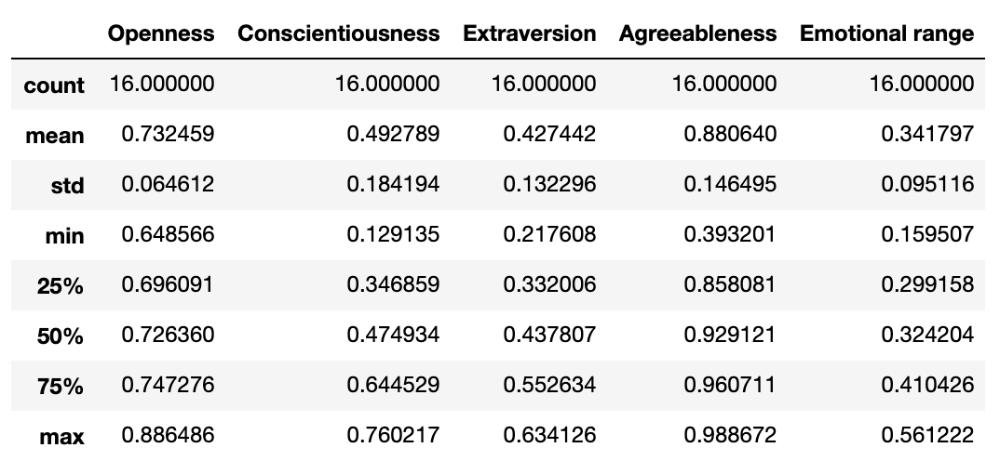
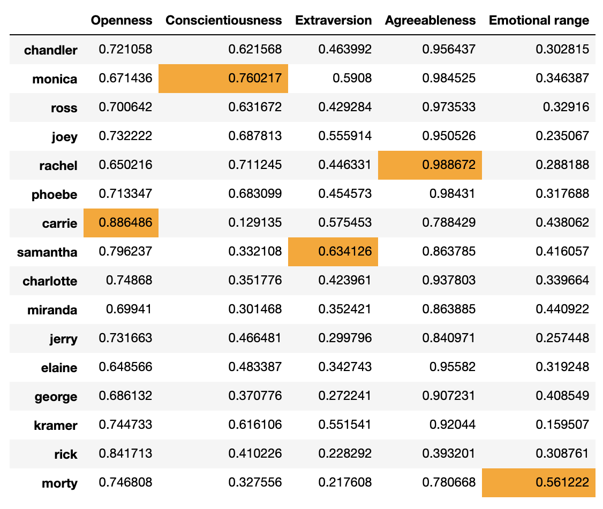
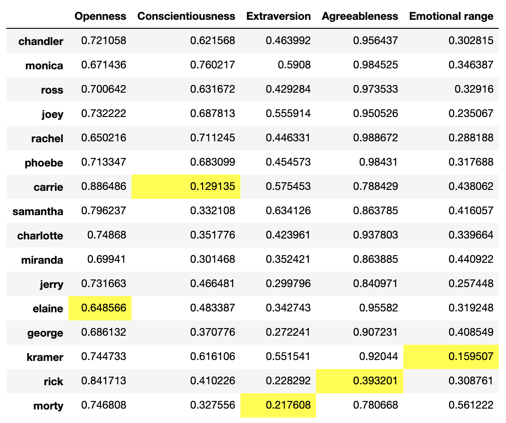
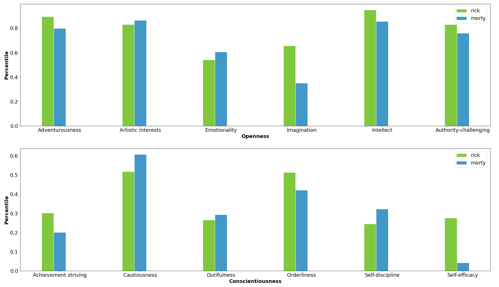
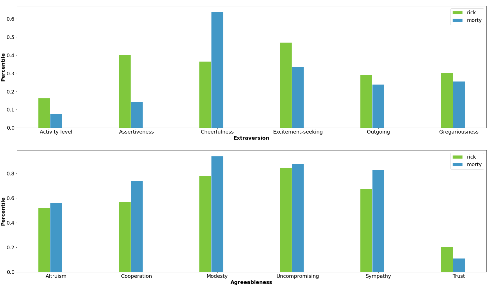
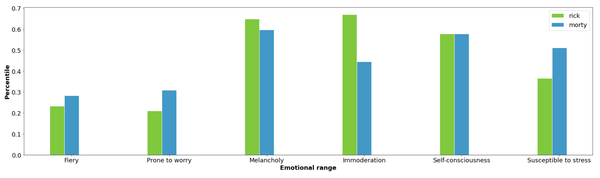

## Project Index
1. [AFL Brownlow Medal Predictor (Regression)](#afl-brownlow-medal-predictor-regression)
2. [Visualizing personalities of sitcom characters (NLP)](#visualizing-personalities-of-sitcom-characters-nlp)
2. [AFL Game Win Loss and Margin Predictor (Classification and Regression)](#afl-game-win-loss-and-margin-predictor-classification-and-regression)

---

# AFL Brownlow Medal Predictor (Regression)


_Disclaimer:_ I do not endorse betting of any kind. This project is not intended to assist me (or you) in making lots of money, but more a fun way to see if machine learning could swing the odds in my favour. Enjoy!

Australian Rules Football is a fantastic game to watch and a brilliant sport to try and predict. Each year, one player is awarded the [Brownlow Medal](https://en.wikipedia.org/wiki/Brownlow_Medal) (the MVP of the season). After each game, the on-field umpires decide which player should receive one-vote, two-votes and three-votes. At the end of the season, all of those votes are tallied and the player with the most, wins the medal. 
This of course draws a lot of betting and speculation to determine who will win the medal. And thus, the problem: 

**Can an algorithm help predict the winner of the Brownlow Medal?**

To help me do so I attained data from the 2003-2019 AFL seasons and trained a model to predict the amount of votes each player will receive in each of those seasons. The player that was predicted to have the highest amount of votes should theoretically be the winner of the medal. 

[The code can be found here.](https://github.com/simonlipson/simon_lipson_projects.github.io/blob/master/AFL%20Brownlow%20Predictor.ipynb)

[A similar experiment using R can be found here ](https://github.com/simonlipson/projects/blob/master/AFL%20brownlow%20predictor.R)
(although it is not related to what is written below).

Less technical folk can skip to the **Generating Predictions** section below.

## The Process

I undertook the following steps as part of this analysis:
1. Collect the data
- [kaggle.com](https://www.kaggle.com/stoney71/aflstats)
- [afltables.com](www.afltables.com)
2. Clean and normalize the data
3. Feature engineering through aggregation
4. Train, test splitting of the data per season
5. Evaluating different regression models
6. Tuning hyperparameters of the chosen model
7. Fitting the model with training data
8. Generating predictions with test data
9. Visualizing the outcomes

You can follow all the above steps in the [Jupyter notebook](https://github.com/simonlipson/simon_lipson_projects.github.io/blob/master/AFL%20Brownlow%20Predictor.ipynb). 
Below are the highlights with some code snippets.

### Evaluating Different Regression Algorithms

I used a k-fold cross validation to evaluate the accuracy of several different regression models. This validation optimized for [r-squared](https://en.wikipedia.org/wiki/Coefficient_of_determination) which is a standard metric for regression algorithm evaluation. See the results below:



The above shows that the Gradient Boosting Regression model (GBM) clearly outperforms the other models. It received a r2 score of ~0.72, where a score of 1.0 is the highest possible score. This is why I chose the GBM model for my analysis.

_snippet of source code_
```python
models = []
models.append(('LR',LinearRegression()))
models.append(('LASSO', Lasso()))
models.append(('EN', ElasticNet()))
models.append(('KNN', KNeighborsRegressor()))
models.append(('CART', DecisionTreeRegressor()))
models.append(('GBM', GradientBoostingRegressor()))


results = []
names = []
for name, model in models:
    kfold = StratifiedKFold(n_splits=10, random_state=1, shuffle=True)
    cv_results = cross_val_score(model, X_train[0], y_train[0], cv=kfold, scoring='r2')
    results.append(cv_results)
    names.append(name)

pyplot.boxplot(results, labels=names)
pyplot.title('Algorithm Comparison')
pyplot.show()
```

### Tuning algorithm for hyperparameters

The GBM has many different parameters that can be changed to further optimize the model's performance. To avoid teadiously trying many different combinations of different parameters, I used grid search cross validation to get the best combination for learning_rate, max_depth, min_depth and max_features. This analysis was conducted with n_estimators = 4000. See the results below:

```python
{'learning_rate': 0.01,
 'max_depth': 4,
 'max_features': 0.3,
 'min_samples_leaf': 17}
 ```
 
 _snippet of source code_
 ```python
 param_grid = {'learning_rate': [0.1, 0.05, 0.02, 0.01],
'max_depth': [4, 6],
'min_samples_leaf': [3, 5, 9, 17],
'max_features': [1.0, 0.3, 0.1]
}

est = GradientBoostingRegressor(n_estimators=4000)

gs_cv = GridSearchCV(est, param_grid, n_jobs=4).fit(X_train[0], y_train[0])

gs_cv.best_params_
```

### Generating Predictions

With the model selected, tuned and fitted, I generated predictions. The model predicts the amount of votes each player would receive at the end of the season. The player with the highest amount of votes is the player that theoretically should have won the medal in that season.

I did this for every season from 2003-2019, training the model with data from all other seasons than the one being predicted on:
- e.g. Predict 2019 winner, train on 2003-2018 data

See the table below for the top 3 predicted highest scorers for each season. The actual winner for that season is **bolded**

|    | 2003                | 2004              | 2005             | 2006               | 2007                 | 2008              | 2009              | 2010                | 2011              | 2012                     | 2013                  | 2014                     | 2015                     | 2016                     | 2017                     | 2018                     | 2019               |
|---:|:--------------------|:------------------|:-----------------|:-------------------|:---------------------|:------------------|:------------------|:--------------------|:------------------|:-------------------------|:----------------------|:-------------------------|:-------------------------|:-------------------------|:-------------------------|:-------------------------|:-------------------|
|  1st | **2003Buckley, Nathan** | 2004Brown, Nathan | 2005Judd, Chris  | 2006Judd, Chris    | 2007Ablett, Gary     | **2008Cooney, Adam** | **2009Ablett, Gary**  | 2010Ablett, Gary    | **2011Swan, Dane**    | 2012Cotchin, Trent       | **2013Ablett, Gary**      | 2014Dangerfield, Patrick | 2015Gray, Robbie         | **2016Dangerfield, Patrick** | **2017Martin, Dustin**       | 2018Dangerfield, Patrick | 2019Kelly, Tim     |
|  2nd | 2003Black, Simon    | **2004Judd, Chris**   | **2005Cousins, Ben** | 2006Goodwin, Simon | 2007Corey, Joel      | 2008Ablett, Gary  | 2009Boyd, Matthew | 2010Montagna, Leigh | 2011Murphy, Marc  | 2012Dangerfield, Patrick | 2013Swan, Dane        | 2014Selwood, Joel        | **2015Fyfe, Nat**            | 2016Kennedy, Josh P      | 2017Dangerfield, Patrick | 2018Cripps, Patrick      | 2019Prestia, Dion  |
|  3rd | 2003Cousins, Ben    | 2004Black, Simon  | 2005Hodge, Luke  | 2006Hall, Barry    | 2007Pavlich, Matthew | 2008Mitchell, Sam  | 2009Swan, Dane    | 2010Swan, Dane      | 2011Mitchell, Sam | 2012Ablett, Gary         | 2013Pendlebury, Scott | 2014Gray, Robbie         | 2015Dangerfield, Patrick | 2016Treloar, Adam        | 2017Mitchell, Tom        | **2018Mitchell, Tom**        | 2019Martin, Dustin |

The model was able to predict the actual winner in the top three 11 out of 17 times, of which seven times it got the actual medalist correct. Whilst those numbers might not be significant enough to place secure bets on, it does show some promise. The analytical value of these predictions are outlined in the conclusion below. 

_snippet of source code_
```python
model = GradientBoostingRegressor(n_estimators=4000, learning_rate= 0.01, max_depth= 4, max_features= 0.3, min_samples_leaf= 17)
results = []
for i in range(len(X_test)):
    model.fit(X_train[i], y_train[i])
    y_pred = model.predict(X_test[i])
    results.append(pd.DataFrame({'actual': y_test[i],
                                'prediction': y_pred})
                  .sort_values('prediction', ascending=False).reset_index())
                  
joined_results = pd.concat(results, axis = 1)
top3 = joined_results['season_player'].head(3)
top3.columns = years
```

### Feature Importance

It was interesting to me to understand which on-field statistics seem to have the greatest impact on the predicted score. As it is the umpires and not the fans who decide, there is a subjectivity that arrises from their specific view-point. This may mean that certain stats that the footy (football) fan may deem to be a good indication of Brownlow vote contention, may actually not be. See the below table to see the importance of each feature:


_snippet of source code_
```python
importance = model.feature_importances_
bars = X_test[0].columns
y_pos = range(len(bars))
pyplot.bar(X_test[0].columns, importance)
pyplot.xticks(y_pos, bars, rotation=90)
pyplot.show()
```

### Conclusion

Unfortunately, the model didn't perform well enough to ensure a cashout with the bookies. However, it did show that in 11 out of the 17 years, the actual winner was within the top 3 of my predictions. As such, the model can be used to complement other available information out there (like the odds) to give a better chance of winning some money. The following betting guide can minimise the possibility of loss (_however I recommend against ACTUALLY using this guide to place real bets_):

1. If the betting favorite has **less than or equal to $2** odds and is in your predictions --> only bet on the favorite
2. If the betting favorite has **more than $2** odds and is in your predictions --> bet same amount on the favorite and next highest prediction
3. If the betting favorite has **more than $3** odds and is in your predictions --> bet same amount on all three of your predictions
4. If the betting favorite is not in your predictions --> have fun and don't expect anything

When applying the above system to the historical betting odds [found here](https://www.sportsnews.com.au/afl/2019-brownlow-medal-odds-and-betting-where-the-late-money-is-going/496203), I achieved the following results: 

- I win money in 9 years (**+$92.05** for $5 bets)
- I lose money in 3 years (**-$25** for $5 bets)
- I break even/don't bet in 5 years

Overall I would have bet $90 over 17 years and received a **profit of $67.05**.

That yields a **return of 74.5%**. Further optimization of the betting system could yield even higher returns.

If for those same years you just bet $5 on the favourite, you end up with a return of 41.2% over 17 years. So using the odds and the model predictions increases your yield by more than 30%

### Further Research

The achieved results do show some promise, however there is definitely still room to improve. I believe that the main downside to this experiment is that the model didn't put enough emphasis on trying to predict the highest polling player, but rather predict the amount of votes for ALL players. Whilst that is still a decent approach, it wasn't able to predict the winner enough times. The next phase of this experiment will try and emphasise who the winner of the medal would be and not to try and predict how many votes everyone received. 

This could involve making several changes in the feature engineering phase. For example, my model looks at data aggregated per season. As such, it doesn't take into account who was the best player per game. Therefore there are many game-day relevant insights that might be missed by the algorithm. For example, if it was a low scoring game, the highest goal kicker wouldn't have have kicked many goals but still might be the best player. That could be true about almost all of the used data points. 

There may also be the ability to engineer features that try and capture player momentum to see if they are on a hot streak. This could help capture a part of the player psychology as well as the umpire psychology. If the "hot" player is constantly being praised in the media, it can have a big impact on their performance and also on how much the umpire is watching them. There are many other features that could be relevant when looking at it on a per-game basis as opposed to a per-season basis. This could be a good avenue for improvement.

---

# Visualizing personalities of sitcom characters (NLP)


Have you ever done one of those Buzzfeed "Which character are you?" games? Or has anyone ever told you "You're such a Ross". I wanted to unpack that a little bit and try and see if there was a way of indentifying what it _means_ to "be a Ross". And thus the problem:

**Can an algorithm recognise personality characteristic from screenplays?**

I'm sure there are many clever and complex ways of going about building my own model that could do this for me. However I don't believe in reinventing the wheel. Instead I decided to use [IBM's Watson](https://www.ibm.com/watson). This is an AI platform that offers many different services, one of which is called Personality Insights and is accessible via [API](https://cloud.ibm.com/apidocs/personality-insights?code=python). 

### The Process

1. Get the data
2. Preprocess that data 
3. Call Watson API for Personality Insights
4. Visualize those insights
5. BONUS: predicting the Rickest Rick and Mortyest Morty

The whole process can be followed in the [Jupyter Notebook](https://github.com/simonlipson/projects/blob/master/Friends%20NLP.ipynb). To see the visualizations in a nice Jupyter Widget you should open the Notebook in Jupyter yourself. Below will be some of the highlights.

### For soup in soups

The first sitcom I wanted to tackle was Friends. I found a [site](https://fangj.github.io/friends/) that contained all of the transcripts. I built a scraper to get all the scripts and then put them into a pandas dataframe. This was relatively easy as the URLs for each script differed only by the number of the episode. Putting them into the dataframe was also relatively simple as I could split the text based on colon ":" to have character and dialogue columns.

_code snippet_

```python
#Crawl all friends scripts for first 9 seasons
pages = []
for i in range(101,923):
    page = requests.get('https://fangj.github.io/friends/season/0{}.html'.format(i))
    pages.append(page)
    
#Parse all scraped htmls into beautiful soups
soups = []
for page in pages:
    if page.status_code == 200:
        soup = BeautifulSoup(page.content, 'html.parser')
        soups.append(soup)
        
#Scrape all the lines from the scripts and put them into data frames
frames = []
for soup in soups:
    lines = []
    for i in range(2,len(soup.find_all('p'))):
        lines.append(soup.find_all('p')[i].get_text())
    df = pd.DataFrame({'line':lines})
    frames.append(df)
    
#Split the data frame so the each character is in the first column
df = df.line.str.split(":", expand = True)
```

### Elementary my dear ...

Once I had all my data from Friends, Seinfeld, Sex and the City and Rick and Morty, it was time to generate personality insights for each of the main characters. This involved sending blocks of text for each character to Watson via API. The output is a json with all the personality characteristics. See below for example of the output:

```json
{
  "word_count": 48683,
  "processed_language": "en",
  "personality": [
    {
      "trait_id": "big5_openness",
      "name": "Openness",
      "category": "personality",
      "percentile": 0.7205221146457056,
      "raw_score": 0.7673095726575155,
      "significant": true
      }
      ]
   }
```

The `personality.name` and `personality.percentile` fields are what I use to visualize the personalities. See next section for visualizations.

_code snippet_

```python
#Instantiate IBM Watson Personality Insights service

authenticator = IAMAuthenticator('<my_api_key>')
service = PersonalityInsightsV3(authenticator = authenticator, version='2017-10-13')
service.set_service_url('<my_service_url>')

friends = ['Chandler', 'Joey', 'Monica', 'Phoebe', 'Rachel', 'Ross']

for friend in friends:
    globals()[friend + '_profile'] = service.profile(
                                                    globals()[friend],
                                                    'application/json',
                                                    consumption_preferences=True,
                                                    raw_scores=True
                                                    ).get_result()
```
### Visualizing the personalities with matplotlib

For each of the four shows I created functions that plots each personality trait's percentile for each character. Watson's insights have several levels. The main one is what they call the big5. They also have insights into the children of each of those traits. These are what I focused on for the visualization. 

Jupyter Notebooks allowed my to use Tab widgets to allow you to easily view all plots. I suggest downloading and opening the notebook yourself to see the plots in the widget. However see screenshots of the plots below.

_code snippet for Rick and Morty visualiztion_
```python
def rnm_create_personality_plot(level):
    labels = [big5['name'] for big5 in rick_profile[level]]
    rick_p = [big5['percentile'] for big5 in rick_profile[level]]
    morty_p = [big5['percentile'] for big5 in morty_profile[level]]
    

    barWidth = 0.15  # the width of the bars

    # Set position of bar on X axis
    r1 = np.arange(len(rick_p))
    r2 = [x + barWidth for x in r1]
    r3 = [x + barWidth for x in r2]
    r4 = [x + barWidth for x in r3]

    # Make the plot
    plt.bar(r1, rick_p, color='#66cc00', width=barWidth, edgecolor='white', label='rick')
    plt.bar(r2, morty_p, color='#0099cc', width=barWidth, edgecolor='white', label='morty')


    # Add xticks on the middle of the group bars
    plt.xlabel(level, fontweight = 'bold')
    plt.xticks([r + barWidth for r in range(len(rick_p))], labels)
    plt.rcParams["figure.figsize"] = (30,8)
    matplotlib.rcParams.update({'font.size': 18})
    plt.ylabel('Percentile', fontweight = 'bold')

    # Create legend & Show graphic
    plt.legend()
    plt.show()
    
rnm_create_personality_plot('personality')
```

### Big 5 Analysis Per Show

#### Friends


#### Seinfeld


#### Sex and the City


#### Rick and Morty 


### A few insights

The characters of the three 90s sitcoms all seem to have similar personalities to the other characters on their shows. This could be explained by several reason, of which could be that they are all written by the same writers, that they are all intended for the same audience, or that Watson just isn't as insightful as we'd hope. Or maybe Watson is less suited to screenplays and better suited to tweets, Yelp reviews or presidential debates. 

Below are some descriptive statistics of the percentiles for the big5 for all of the characters.



We could see in the graphs that all characters (except for Rick) had very high levels of Agreeableness and very low levels of Emotional Range. This is also observable when we look at the mean value for these traits in the descriptive statistics above. I don't think its too surprising either, given that these are all characters that audiences need to love (hence the high agreeableness). The emotional range can possibly be explained by the fact that the shows all have less than 30 minute episodes and are all comedies. There isn't enough time or need to develop complex and broad storylines that portray all of the ups and downs of each character that reflect the everyday of everyday people. Rather, we want to see Joey be loveable, Samantha be raunchy, George be paranoid and Rick be cynical. 

See below the characters with the highest and lowest levels of each trait.

#### Highest



#### Lowest



Above we see that Carrie from Sex and the City is at the same time the most open and the least conscientious. Actually all characters from Sex and the City had higher openness than all the other shows, likely due to how much they are willing to reveal about their love lives. 

Rachel is the most agreeable character (and hence probably why she is such a fan favourite) and Rick is the least (not surprising due to his lack of caring).

Kramer has the least emotional range which seems to be a good judge of his character. And Morty is the least extraverted (which isn't doing him too many favours with Jessica).

Surprisingly, Monica is the most conscientious. And less surprisingly Samantha is the most extraverted (although I feel many people would have given this one to Phoebe).

### Bonus: Rick and Morty further analysis

Whilst I was impressed by Watson's ability to deduce personality insights, I feel it is still far behind the average viewers' ability to do so. As observable above, the characters in each of the 90s sitcoms are very similar to their co-characters. There wasn't a great deal of variance in their percentiles of the big 5 traits. Rick and Morty did show a bit more variance. When I looked further into Watson's output for Rick and Morty, there was a much more observable variance between them than for the characters on the other shows.

#### Child traits for each of the big 5





We can see that Rick has much more imagination, self-efficacy, assertiveness and immoderation than Morty. Yet Morty is more cautious, cheerful (no-surprise there), sympathetic, prone to worry and susceptable to stress than Rick. Any viewer of the show would agree with these. Although there are others that Watson got wrong, like Morty having a similar level of intellect to Rick or Rick being more trusting than Morty. Regardless, there is clearly an observable difference between these two characters.

As such, it seemed that the difference could lend itself well to prediction. As such I went about training a classifier to see if it could classify a line as being said by Rick or by Morty. So with the same data I used to generate the personality profiles, I went about extracting features, training a model and creating predictions. 

#### TF-IDF Vectorization

I extracted features from each line of dialogue using TfidfVectorizer. This created a matrix of vectors that became the input for my training sets. The names of the characters was the test set.

I used a LogisticRegression classifier and split the data 80/20 for training and testing.

Upon having trained the model and created predictions, the model was able to achieve the following performance:

```
              precision    recall  f1-score   support

       Morty       0.74      0.22      0.34        63
        Rick       0.64      0.95      0.76        91

    accuracy                           0.65       154
   macro avg       0.69      0.58      0.55       154
weighted avg       0.68      0.65      0.59       154
```
Overall accuracy of 0.65. 

Not amazing but its better than random choice. There is a lot more optimization that can be done to help improve this score. For example testing other models with k-fold cross-validation, tuning for hyperparameters with gridsearch and other NLP feature extraction methods like word-embedding and creating rule-based linguistic features. 

_code snippet_
```python
y = rick_and_morty_lines['name']

tfv = TfidfVectorizer(ngram_range=(2,4), max_features=2000)
X = tfv.fit_transform(rick_and_morty_lines['line']).todense()

X_train, X_test, y_train, y_test = train_test_split(X, y, test_size = 0.2, random_state = 0)

model = LogisticRegression()
model.fit(X_train, y_train)

y_pred = model.predict(X_test)
```

#### The Rickest Rick

I was curious to see which lines were given the highest probability of being Rick and Morty. So I also output the probabilities with `model.predict_proba` and joined it back to my original data frame. By taking the maximum probability for for each character, the following lines are deemed to be the "rickest rick" and "mortyest morty":

**Rickest Rick**: "When I drop the bomb you know, I want you to have somebody, you know? I want you to have the thing. I'm gonna make it like a new Adam and Eve, and you're gonna be Adam."

**Mortyest Morty**: "Oh, man, Rick. What is this place?"


### Conclusion

Whilst I don't believe that IBM's Watson or my classifier will be able to outperform a human at deciphering personality traits anytime soon, I do believe that it was cool to see that machines could process text in a better than random way. I found it very interesting to be able to connect to a service as cool and futuristic as Watson from my own living room and get results within seconds. When services like these get better with time, there will be many awesome possibilities that can be achieved by data scientists with fewer resources than those working in large organizations. I plan to take full advantage of all of those opportunities. 

---

# AFL Game Win Loss and Margin Predictor (Classification and Regression)


Using the same Kaggle data set as used in the [Brownlow predictor](#afl-brownlow-medal-predictor-regression) above, I created a classifier to determine which team wins a game and by how much based on the game day stats (not including goals and points obviously). This has no analytical value that can help with sports betting as you can't bet on a match after the game. However it can indicate to coaches and players which parts of the game seem to determine the winner of the game. And it was just a fun way for me to run two models, one classification and one regression.

Please see the [Jupyter Notebook here.](https://github.com/simonlipson/projects/blob/master/AFL_Win_Loss_classifier.ipynb)
